# KYC Analysis Report

## Conclusions

1. The overall KYC pass rate is 61.57%. [daily_pass_rates.png]
2. The pass rate has decreased over time. [daily_pass_rates.png]
3. The main reason for KYC failures is Anomaly: Passed but Flagged as Failure. [failure_reasons.png]
4. The document type with the highest pass rate is birth_certificate. [doc_type_pass_rates.png]
5. The document type with the lowest pass rate is voter_id. [doc_type_pass_rates.png]
6. The country with the highest pass rate is AFG. [top_10_countries.png]
7. The country with the lowest pass rate is BMU. [top_10_countries.png]
8. Female applicants have a higher pass rate. [gender_pass_rates.png]
9. The KYC pass rates are not stationary over time.
10. Seasonal patterns show highest pass rates in June 2017.
11. 10 anomalies were detected in the pass rates time series.

## Recommendations

1. Focus on improving the Anomaly: Passed but Flagged as Failure check process, as it's the main reason for failures. [failure_reasons.png]
2. Enhance the verification process for voter_id documents, which have the lowest pass rate. [doc_type_pass_rates.png]
3. Investigate why BMU has the lowest pass rate and implement country-specific improvements. [top_10_countries.png]
4. Provide clearer instructions to users on how to take high-quality photos for both documents and facial images. [failure_reasons.png]
5. Implement a feedback loop to continuously monitor and improve the KYC process. [daily_pass_rates.png]
6. Address the gender disparity in pass rates, focusing on improving the process for male applicants. [gender_pass_rates.png]
7. Consider implementing a system to remind users to update their documents well before expiry. [expiry_vs_outcome.png]
8. Develop a risk-based approach, potentially fast-tracking applications from low-risk countries and age groups. [top_10_countries.png]
9. Invest in machine learning models to predict KYC outcomes and identify high-risk applications early in the process. [failure_reasons.png]
10. Implement strategies to address seasonal variations in pass rates.
11. Investigate and address the root causes of detected anomalies in pass rates.
12. Focus on improving passport document verification process, which shows consistently lower pass rates.

## Supporting Graphs

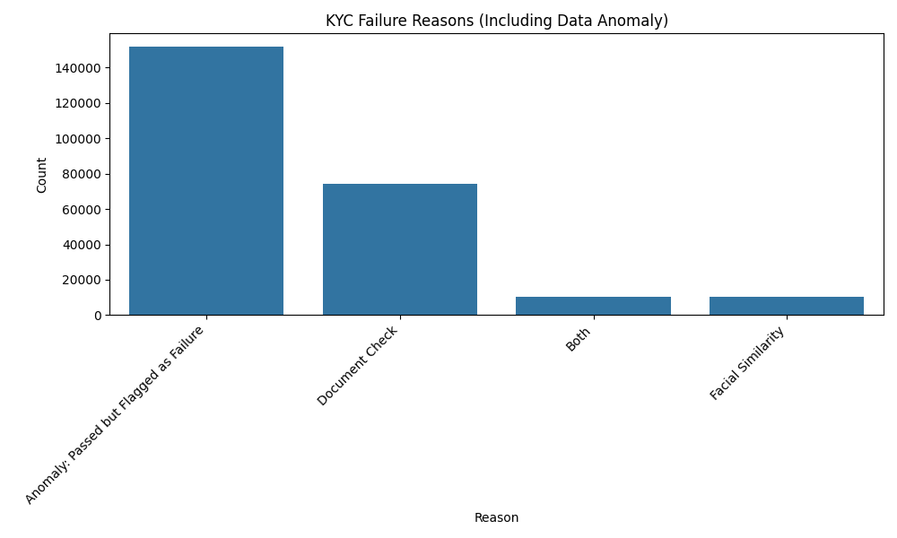

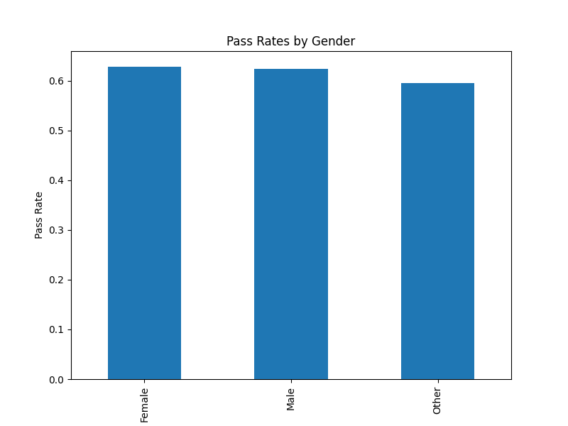

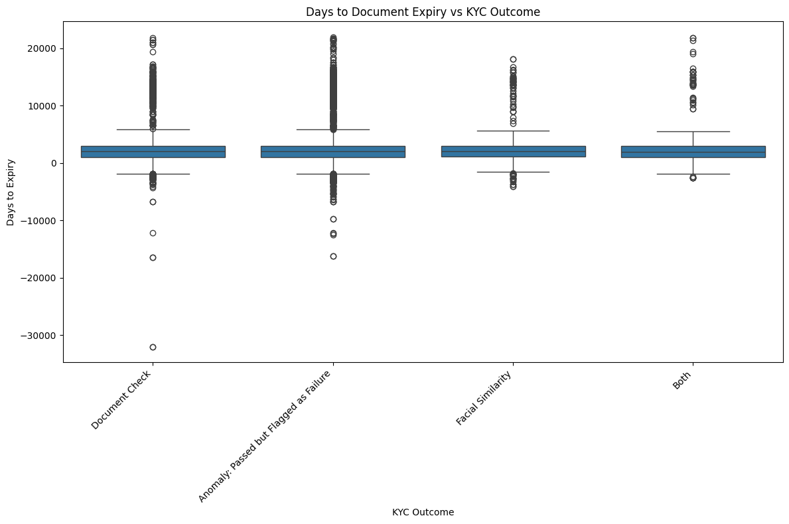

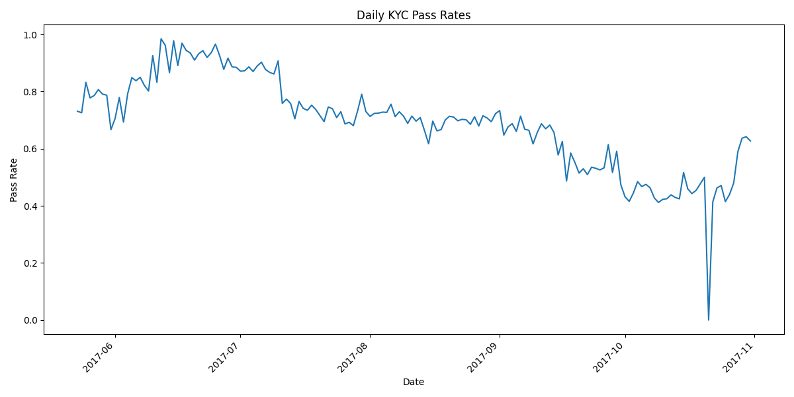

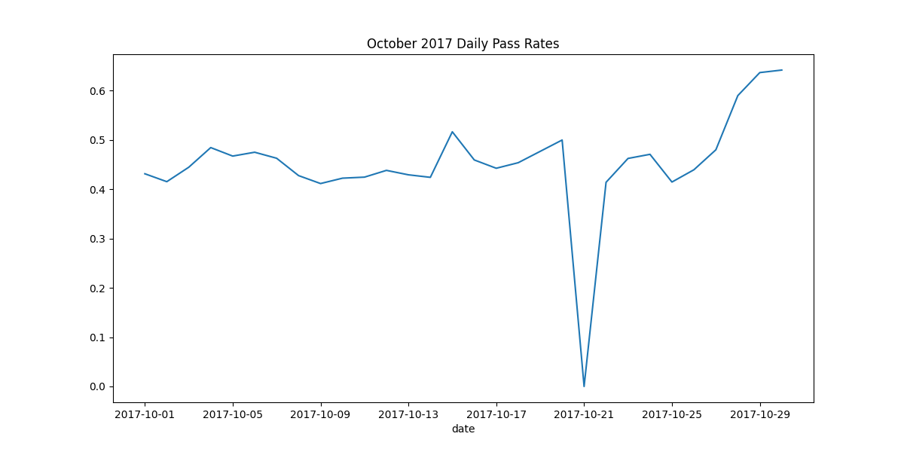

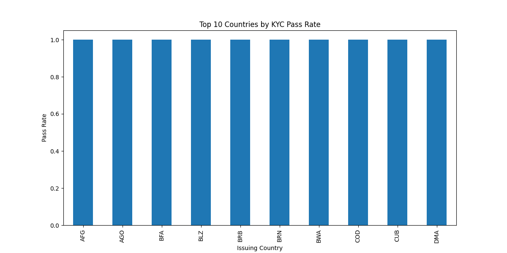

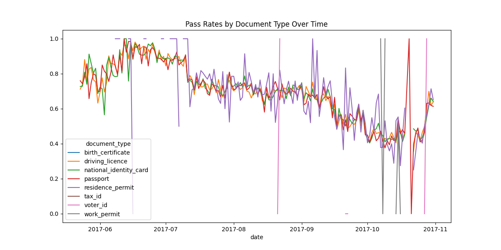

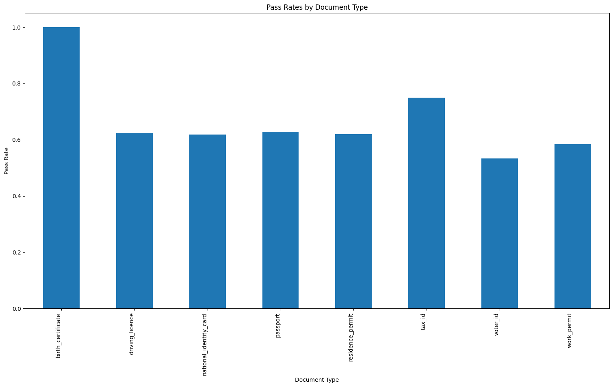

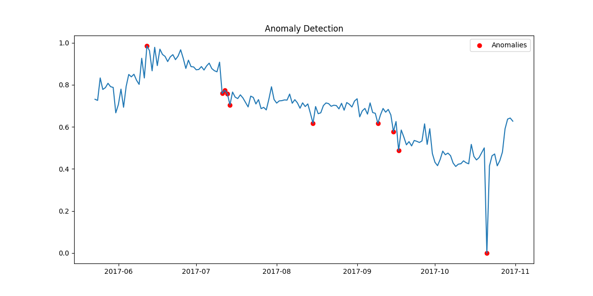

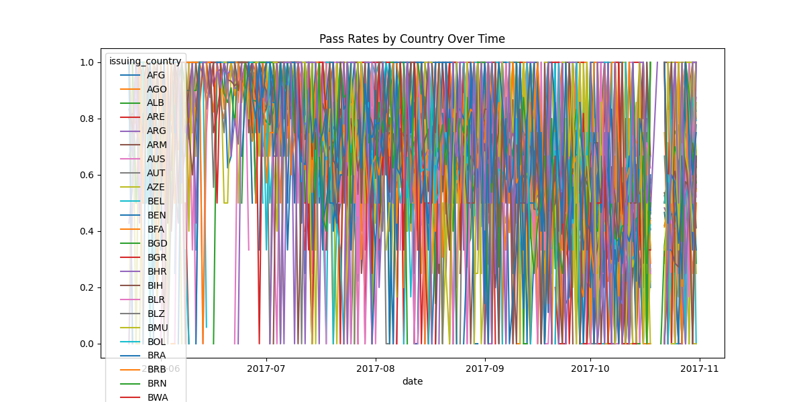

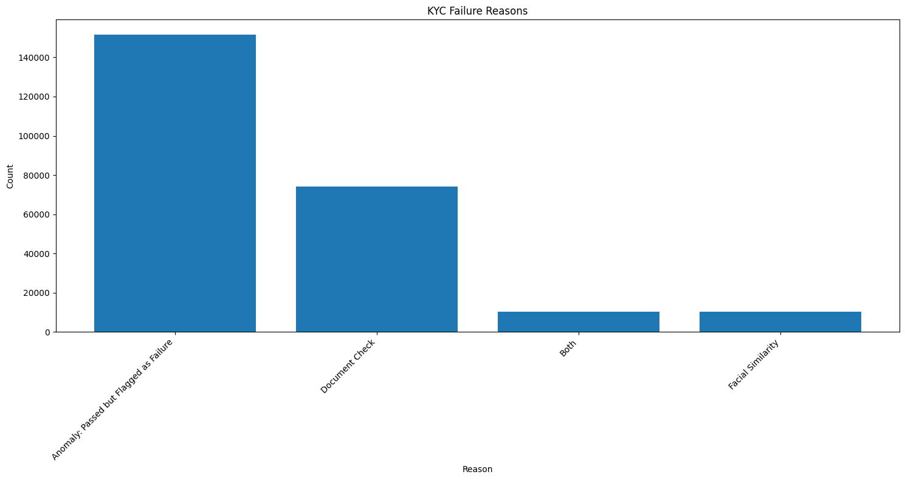

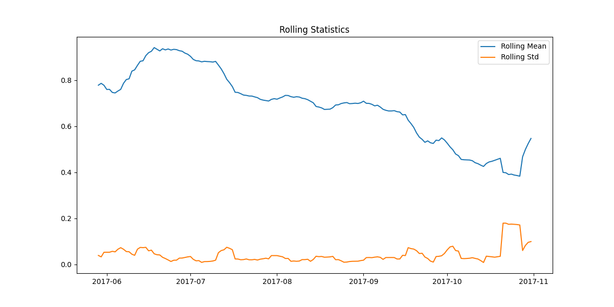

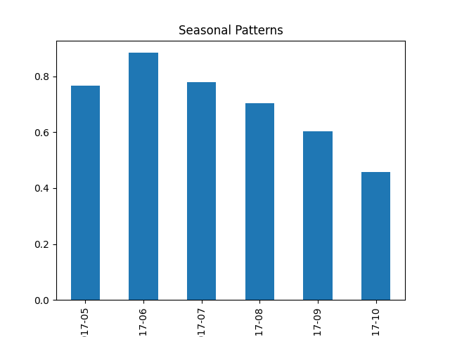

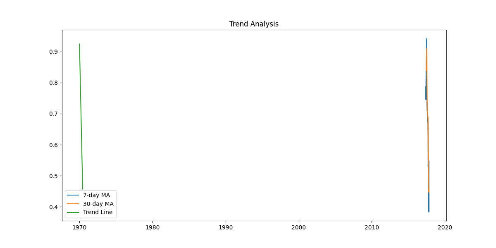

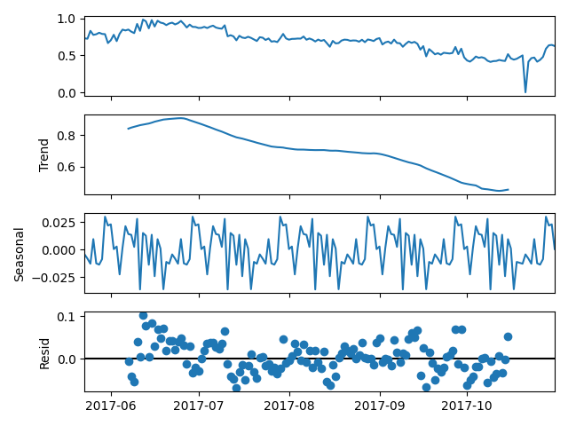

## October 2017 Anomaly Analysis

Daily pass rates analysis for October 2017 is available.
Top failure reason: Document Check
Document type with highest pass rate: voter_id
Country with highest pass rate: AGO
Gender with highest pass rate: Other

## Time Series Analysis

The time series is non-stationary.
Trend analysis results are available.
Seasonal patterns analysis is available. Highest pass rates in June 2017.
Anomaly detection results are available, but in an unexpected format.

## Interdependency Analysis

Pass rates by document type over time are available.
Pass rates by country over time are available.
